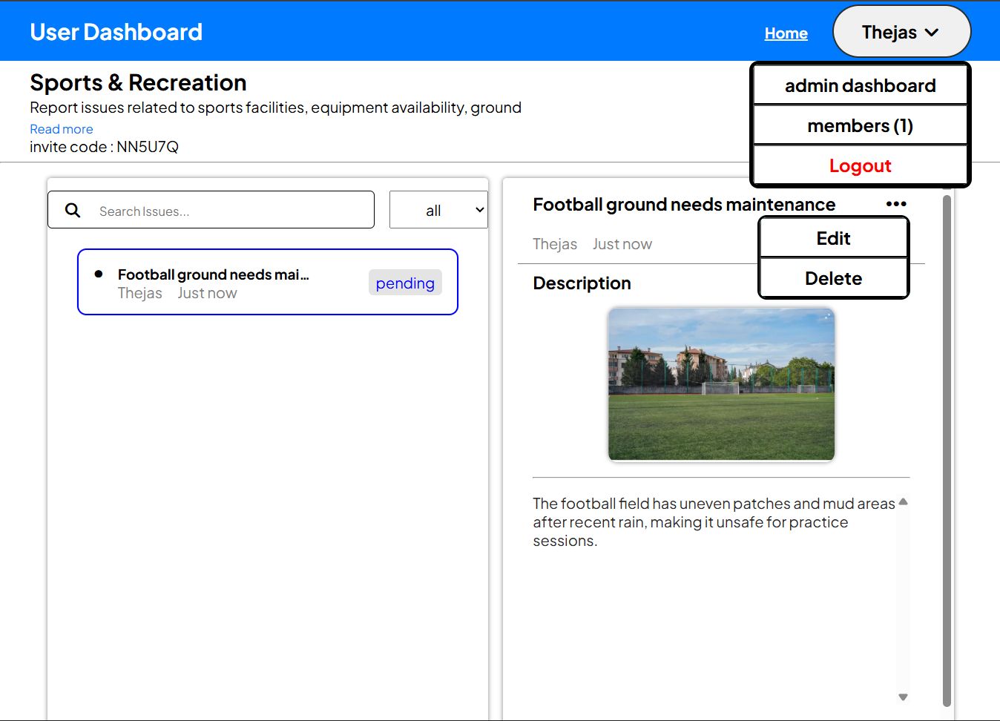
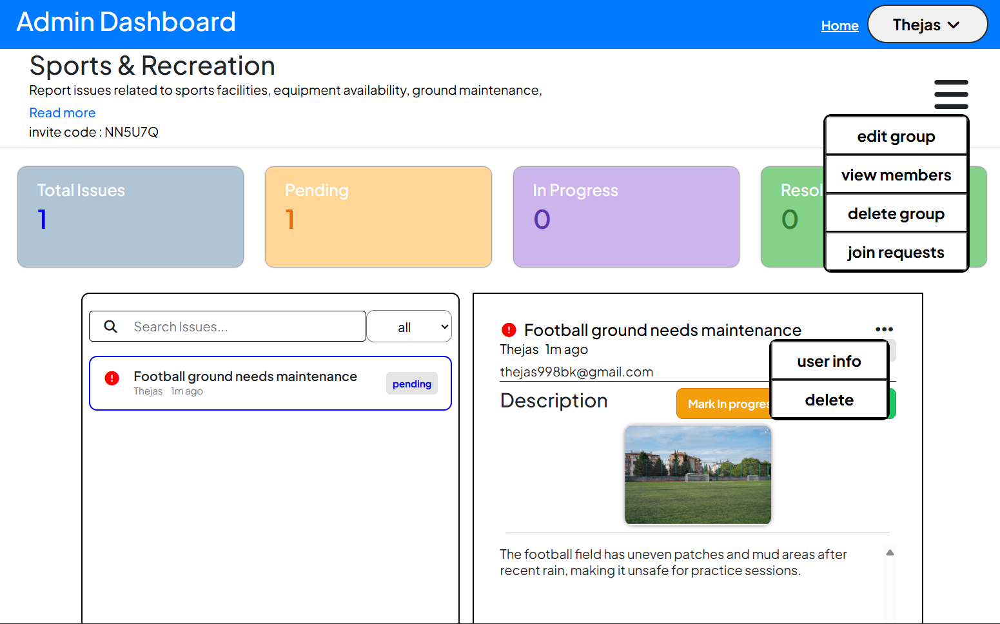

🚀 Issue Management System

Managing campus issues is often slow and unorganized.
This platform provides a centralized system where users can report problems, monitor progress, and collaborate within specific community groups.

The application supports role-based access, real-time feedback, and performance-optimized workflows to deliver a smooth user experience.

## 🌐 Live Demo

👉 https://thejas-bk.github.io/Issue_Tracker/

  

  

## ✨ Features

### 👤 User Features
- Join community groups
- Report issues with descriptions and images
- Track issue status (Pending / Resolved)
- Edit or delete personal reports
- Fully responsive dashboard

### 🧑‍💼 Admin Features
- Manage group members
- Monitor reported issues
- Moderate and update issue status
- Community administration tools

### ⚡ Smart Engineering Features
- Client-side image compression
- Async loading states
- Toast notification system
- Server health monitoring

## 🎯 Project Highlights
- Built as a Single Page Application (SPA)
- Production-style authentication flow
- Optimized image uploads for performance
- Clean modular backend architecture
- Real-world campus problem solving

## 🛠️ Tech Stack
### 🎨 Frontend
- HTML5
- CSS3
- JavaScript (Vanilla JS)
- Bootstrap

### ⚙️ Backend
- Node.js
- Express.js

### 🗄️ Database
- MongoDB
- Mongoose ODM (Object Data Modeling)

### 🔐 Authentication & Security
- JWT Authentication
- Access & Refresh Tokens
- Protected API Routes
- Role-based Authorization

## 👨‍💻 Author

Thejas BK
Computer Science Student | Full Stack Developer